# 2025年排名前15的虚拟接待员服务平台汇总(最新整理)

小型企业和专业服务机构每天会接到大量客户来电,但如果缺乏专业的电话接听团队,可能会错失宝贵的商机。虚拟接待员服务通过真人客服和AI技术结合的方式,帮助企业实现24/7全天候电话覆盖,平均每月可节省10小时以上的工作时间,同时提升客户满意度并捕获更多潜在客户。本文精选了15个功能强大、用户评价高的虚拟接待员平台,涵盖法律、医疗、家庭服务、初创公司等多种行业场景,助您找到最适合业务需求的电话管理解决方案。

## **[Ruby](https://www.ruby.com)**

为中小企业提供全天候专业电话接听和在线聊天服务的行业领导者。

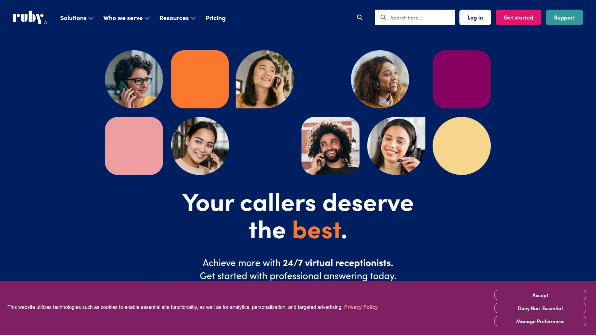

Ruby通过结合行业领先的培训体系和AI增强技术,为超过15000家小型企业提供24/7虚拟接待员服务。平台的核心优势在于真人客服响应速度,平均接听时间少于10秒,确保每位来电者都能立即与真实的人沟通而非语音信箱。Ruby的客服团队每年为客户捕获超过160万个潜在客户,每月处理110万次以上的对话,并自动过滤超过2万个骚扰电话。

服务范围覆盖律师事务所、医疗诊所、建筑承包商、美容沙龙和初创企业等各类行业,客户反馈显示使用Ruby后平均每月可节省10小时以上的时间。平台提供多种定制化方案,从基础的50分钟套餐(245美元/月)到500分钟的企业级套餐,满足不同规模业务的需求。客服团队不仅负责接听来电、安排预约,还能根据客户需求进行呼叫筛选和转接,确保您只与符合标准的潜在客户通话。拥有超过20年服务小型企业的经验,Ruby已成为业界公认的虚拟接待员服务首选平台。

## **[Smith.ai](https://smith.ai)**

结合AI智能接待和真人客服的混合型平台,专注于潜在客户筛选和多渠道沟通。

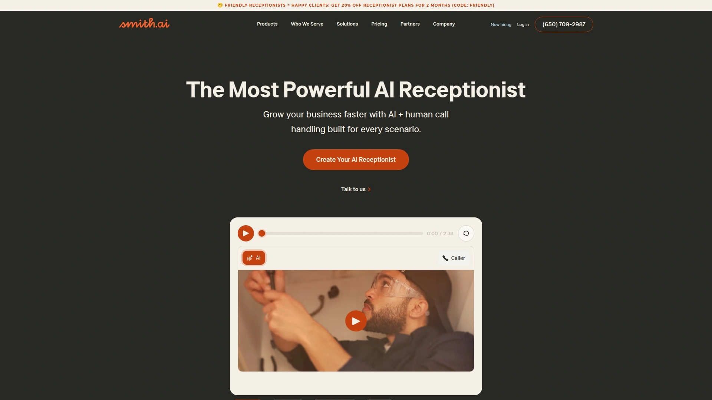

Smith.ai采用独特的"人机协作"模式,AI接待员处理常规来电并将无法解决的复杂问题自动升级至真人客服,确保服务的可靠性和专业性。平台的潜在客户筛选功能支持无限量自定义问题,帮助企业自动收集和评估潜在客户信息,确保只与预先筛选合格的客户进行深度沟通。呼叫者类型工作流可根据来电者身份(新客户、现有客户、供应商等)自动匹配定制化脚本和处理流程。

实时仪表板提供完整的呼叫量、处理记录、通话录音和垃圾电话过滤数据,方便企业随时监控服务质量并快速调整策略。定价分为四个层级:入门版30通/月97.5美元(AI版)或292.5美元/月(真人版),基础版90通/月270美元(AI版)或787.5美元(真人版),专业版300通/月825美元(AI版)或2025美元(真人版),企业版可定制。平台集成超过5000个第三方应用,包括ActiveCampaign、GoDaddy、Google Analytics和Mailchimp等主流CRM和营销工具。提供24/7全天候服务,支持多语言接听、在线聊天、短信和支付收集功能。

## **[AnswerConnect](https://www.answerconnect.com)**

注重环保理念的24/7真人接听服务,提供预约管理和实时监控门户。

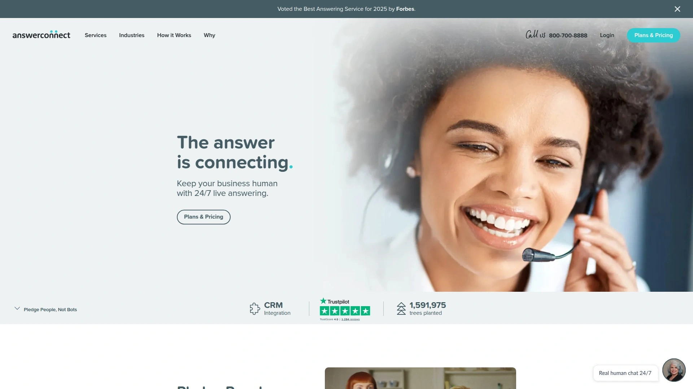

AnswerConnect以专业的真人接待团队为核心竞争力,确保每一通来电都由经过严格培训的客服人员接听和处理。平台特别适合需要个性化服务触感的企业,提供呼叫转接和路由、预约预订以及客户Web访问门户等功能。200分钟套餐定价为350美元/月,涵盖基础的消息接收、呼叫筛选和转接服务。

系统集成Freshdesk、Microsoft Teams、Salesforce和Serviceminder等主流企业软件,实现无缝协作。AnswerConnect的客服团队在接听电话前会先向接收方通报来电信息,允许企业决定是否先与来电者简短沟通后再正式转接(温暖转接),提升客户体验。作为环保意识强的服务提供商,平台致力于在提供高质量客户服务的同时减少碳足迹,吸引了众多注重企业社会责任的客户。24/7全年无休的服务覆盖确保企业在任何时间都不会错过重要商机。

## **[PATLive](https://www.patlive.com)**

拥有35年经验的高呼叫量专业平台,配备全美客服团队和本地化智能工具。

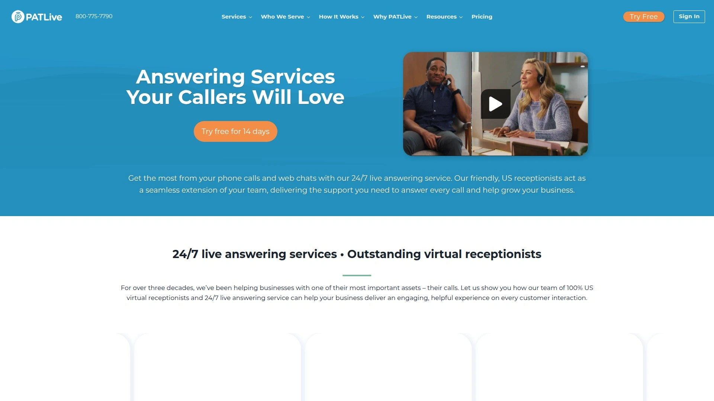

PATLive自1990年成立以来,一直专注于为各类机构提供24/7全天候真人接听服务,所有客服均为美国本土员工。2025年推出的新一代Live Receptionist Portal配备了实时本地地图、天气更新和高级定制功能,使客服能够提供更贴近当地的服务体验。客服可以引用当地天气状况、理解区域商业需求甚至协助导航,让每次通话都更具相关性和参与感。

平台的灵活脚本系统和全天候覆盖能力使其特别适合律师事务所等对专业性要求极高的行业。与Clio等法律管理软件的集成可将所有来电详情直接发送到现有系统,减少重复工作并提升效率。PATLive的客户咨询流程与Clio账户无缝集成,一旦接到新客户来电立即通知律师,确保能够第一时间跟进潜在客户。所有客服均经过全面审核和定期审计,目标是在20秒内接听每一通来电。入门套餐从198美元/月起,适合处理高呼叫量的中小企业。平台的内部开发团队可根据客户独特工作流程定制解决方案,提供的不仅是服务,更是长期业务增长的合作伙伴。

## **[Davinci Virtual](https://www.davincivirtual.com)**

经济实惠的入门级选择,提供基础和高级两种套餐灵活满足不同需求。

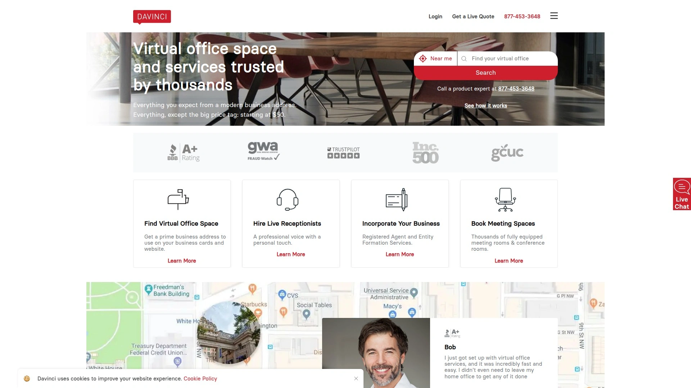

Davinci Virtual以极具竞争力的价格提供专业虚拟接待员服务,最受欢迎的Business 50套餐仅需129美元/月。平台将虚拟接待员定位为远程工作的专业客服,每当公司接到来电时,客户会听到友好专业的真人声音而非自动语音系统。虚拟接待员可以处理消息接收、检查可用性、转接来电、安排预约、拨打外呼电话以及回答客户问题。

套餐分为基础Business计划和高级Premium计划两类:Business计划包含免费本地或免费电话号码、真人接听、呼叫转接和筛选、语音信箱管理、高级呼叫路由和会议功能、无限长途通话、自动接待服务和在线传真。Premium计划在此基础上增加预约安排、外呼电话、订单处理、客户服务、行政助理任务以及特殊FAQ和复杂呼叫流处理。两种计划均提供50分钟和100分钟的覆盖选项,套餐价格从129美元到319美元/月不等。

设置流程简便快捷,购买后一个工作小时内专属客户服务代表会联系您协助开始使用。只需填写在线表单告知如何接听和转接来电,接待团队接受业务培训后团队负责人会确认设置完成。平台还提供Live Web Chat功能,在网站上嵌入定制化聊天窗口,由专业聊天客服团队提供客户支持、回答问题并将网站流量转化为潜在客户。适合刚起步的小型企业和预算有限的个体创业者。

## **[VoiceNation](https://www.moneypenny.com/us/about-us/voicenation/)**

即时激活的快速部署平台,提供双语服务和灵活的按月付费模式。

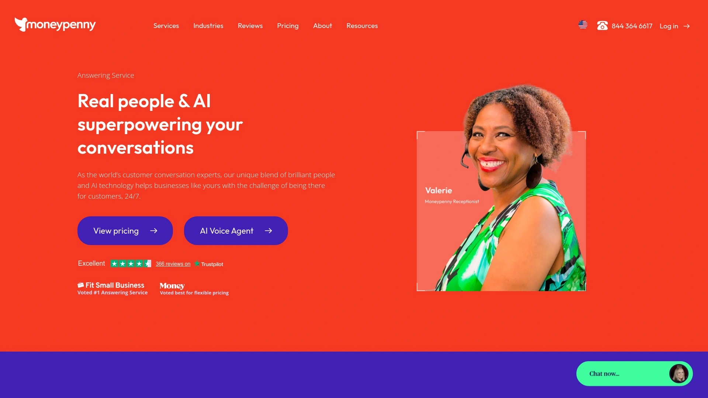

VoiceNation(现为Moneypenny旗下品牌)以快速部署和即时激活为核心特色,企业在线下单后数秒内即可激活真人接听服务,立即获得独特的本地或免费电话号码供客服接听来电。平台提供24/7全年无休的真人接听,无需额外支付夜间、周末或节假日费用。双语接听服务支持英语和西班牙语客户,确保服务的广泛可及性。

定制化响应功能允许企业提供脚本化回复以保持品牌一致性并提供个性化客户互动。来电者信息收集无限制,确保客服能够记录完整的沟通详情。员工联系人数量无限制,企业可以添加任意数量的员工和来电类型以实现精准呼叫路由。消息接收和即时通知通过电子邮件、短信或两者同时发送,确保重要信息不会遗漏。

在线仪表板管理系统允许企业实时管理服务、跟踪来电并查看消息记录。潜在客户筛选功能帮助企业过滤和评估潜在客户,提高转化几率。移动应用让企业主可以随时随地查看消息、实时调整设置并管理服务。平台采用灵活的按月付费模式,无锁定合同,仅需提前一个月通知即可终止服务。入门套餐从59美元/月起,是业界最经济实惠的选项之一。免费试用期提供7天或30分钟(以先达到者为准)的完整功能体验。

## **[Go Answer](https://www.goanswer.io)**

HIPAA合规的医疗行业专业平台,配备受过医疗培训的客服团队。

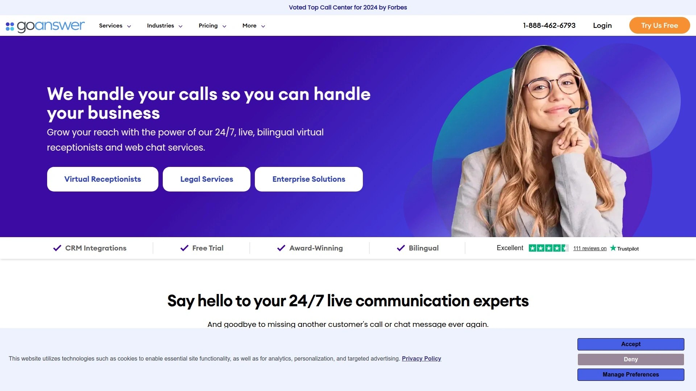

Go Answer专注于为医疗保健行业提供符合HIPAA法规的专业接听服务,确保患者隐私和数据安全。平台的全天候可用性对于医生接听服务至关重要,保证患者无论何时致电都能获得及时援助和支持。所有员工均接受全面的HIPAA合规培训,实施了联邦和州信息安全法律要求的政策、流程和程序。

双语客服能够有效与更广泛的患者群体沟通,提高整体患者满意度并确保语言障碍不会妨碍高质量护理的提供。安全消息传递和数据加密技术保护受保护健康信息(PHI)在通信和存储过程中的安全性。平台提供技术服务支持将消息集成到行业特定应用中,技术支持还可以与电子健康记录(EHR)系统集成以进一步提高效率。

定制化脚本和消息传递允许医疗机构根据特定需求定制接听服务,优化沟通渠道。最低套餐从175美元/月起(最少100分钟/月),适合需要HIPAA合规的医疗诊所、牙科诊所和医生办公室。集成Calendly、HubSpot、Pipedrive和Zendesk等工具实现无缝工作流。Go Answer还为其他需要高度数据隐私保护的行业提供服务,确保所有客户沟通符合最严格的法律标准。

## **[Abby Connect](https://www.abby.com)**

消费者评价第一的虚拟接待员服务,配备专属团队和AI增强技术。

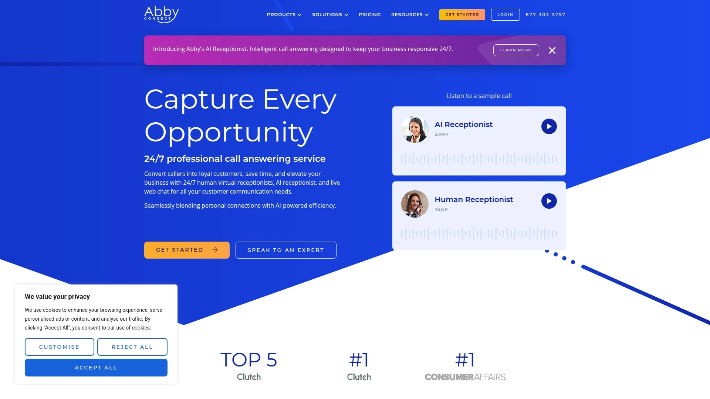

Abby Connect荣获Consumer Affairs评选的虚拟接待员服务第一名,将顶尖客户服务专家与先进技术相结合,将企业电话转化为客户满意度提升、潜在客户捕获和收入增长的利器。每位Abby客户及其来电者都能享受VIP待遇,配备专属服务团队以及全面的账户定制资源。平台为小型企业、律师事务所、建筑公司、牙科或医疗诊所以及家庭服务企业提供最佳的电话处理功能。

2025年9月,Abby Connect成功推出了基于Deepgram实时语音转文字技术构建的新AI接待员产品线,通过选用Deepgram技术实现高触感客户体验的规模化扩展,同时满足法律、医疗和家庭服务等行业的严格需求。24/7真人虚拟接待员、AI接待员和在线聊天服务无缝融合个人化连接与AI驱动效率。

专属团队会专门针对您的业务进行培训,确保能够有效接听来电。团队协助连接电话系统以便立即开始使用。使用Abby Connect的企业主平均每周节省13小时以上。优先考虑更优质的电话客户服务已被证明能够增加收入、提高留存率和满意度。移动应用和客户门户允许您查看所有日志和来电信息,确保不会错过任何动态。定价方案专为成长型企业设计并随业务增长而扩展。

## **[Moneypenny](https://www.moneypenny.com/us/)**

全球领先的接听服务提供商,提供即时激活和双语接待员支持。

Moneypenny是世界领先的接听服务提供商,提供24/7/365全天候服务,配备双语接待员并提供潜在客户捕获、预约安排等多项功能。平台突出的用户友好特性是即时激活,客户在线下单后数秒内即可激活真人接听服务,立即获得独特的本地或免费电话号码供真人接待员代表接听来电。消息通过电子邮件发送并可通过在线仪表板访问。

服务套餐分为Essentials计划和Personalized计划两种:Essentials计划涵盖基本功能如双语接待员、消息接收和温暖呼叫转接,Personalized计划针对特定需求如呼叫调度、客户咨询服务和预约安排。超过500分钟需求可选择更大的分钟套餐。订阅不包含设置费或管理费,但取消需要提前一个月通知。免费试用提供7天或30分钟(以先达到者为准)的服务体验,包含24/7真人接听、无合同义务、即时激活和基本消息接收。

用户可通过浏览器或移动应用登录在线仪表板获取来电分钟数的实时更新。根据Moneypenny评价,在线接听仪表板易于使用,允许随时从任何位置即时更改账户设置如呼叫脚本和工作时间。平台根据客户偏好转接全部或部分来电,真人接待员接听来电后会将其与从客户处收集的所有信息一起转接给您。在紧急情况下可按设定间隔不断尝试呼叫直到您接听。支持渠道包括电话、电子邮件和在线聊天,知识库回答关于客户账户、账单和账户支持的常规咨询。

## **[MAP Communications](https://www.mapcommunications.com)**

拥有25年以上经验的洛杉矶地区老牌服务商,提供完全HIPAA合规解决方案。

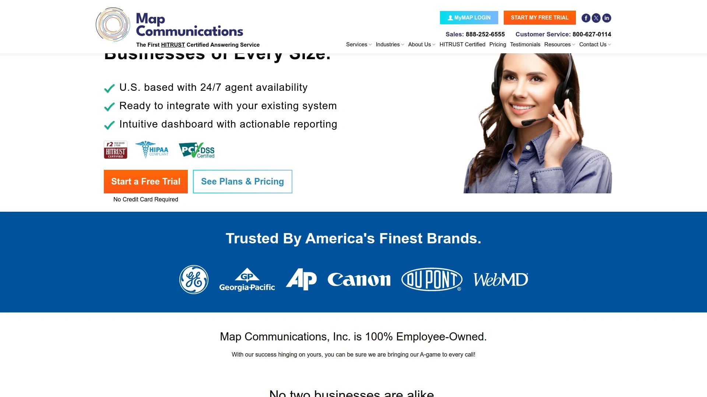

MAP Communications为洛杉矶地区企业提供经济实惠的接听服务已超过25年,能够为任何行业定制真人接听解决方案。无论客户身处什么行业,平台都能提供世界级的客户体验,为业务带来显著改善。对于同时兼顾多项任务的洛杉矶企业主而言,办公室电话往往是最大的时间窃贼,MAP Communications提供24小时真人电话接听解决方案帮助企业夺回宝贵的生产力。

平台提供24/7全天候服务,确保即使在营业时间之外也不会错过任何来电。客服团队日夜工作,确保无论何时拨打电话线路另一端总有友好、乐于助人的声音。潜在客户筛选服务帮助企业穿透噪音,审查每个潜在客户并仅转接符合高标准的来电。完全符合HIPAA法规,了解谨慎处理患者数据的重要性,每位虚拟接待员都接受过HIPAA合规培训。

技能娴熟的接待员提供可定制解决方案,通过每次互动提升企业声誉。定制化呼叫处理和脚本确保使用企业名称和个性化问候接听来电,提供无缝支持。呼叫筛选和消息接收功能过滤和记录来电,确保您仅收到重要的消息。周末、夜间或节假日无额外费用。MAP的下班后服务提供持续的客户支持、真人覆盖,确保来电永远不会被错误处理。

## **[AnswerFirst](https://answerfirst.com)**

真正按秒计费的透明定价平台,提供美国本土客服和自动最优费率调整。

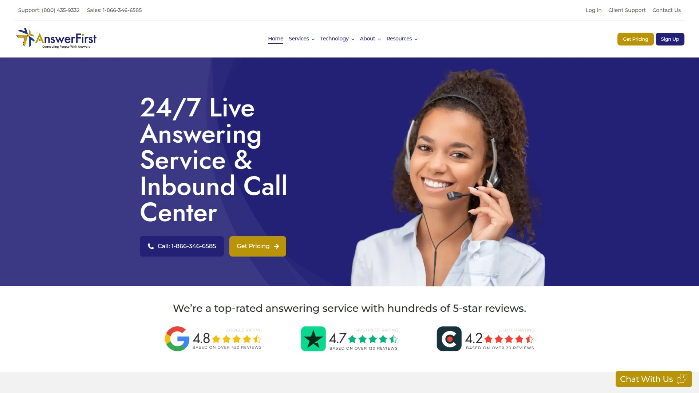

AnswerFirst采用独特的真正按秒计费模式,不会将通话时长向上取整到最近的分钟数,确保客户只为实际使用的服务付费。账户费用为每月30美元,每分钟费率根据使用量从1.50美元到1.85美元不等,系统每月自动调整至最优费率。无需承诺最低使用量或固定分钟计划,采用按需付费模式。

所有客服均为美国本土专业人员,绝不外包至海外,确保文化契合度和沟通质量。24/7全天候服务,周末、夜间或节假日无额外费用。定制化呼叫处理和脚本功能确保使用企业名称和个性化问候接听来电。呼叫筛选和消息接收服务过滤并记录来电,确保您仅收到重要的消息。

24/7安全Web门户允许企业随时收听通话录音、查看报告并管理账户。与大多数商业软件免费集成,可点击了解Express API集成。可随时下载详细的呼叫报告,提供完全透明度。从任何地方通过安全Web门户轻松管理账户。

平台解决的核心痛点包括:错过过多电话来电(每个未接来电都是潜在的商机损失)、需要24/7支持(客户期望在标准营业时间之外也能获得服务)、客户因漫长等待时间感到沮丧(长时间等待导致客户不满和收入损失)、内部员工在高峰呼叫时段不堪重负(繁忙季节和意外呼叫激增可能压垮团队)。AnswerFirst作为虚拟接听服务充当业务的延伸,管理溢出来电并确保每位客户获得应有的关注。

## **[ReceptionHQ](https://www.receptionhq.com)**

全球运营的虚拟接待平台,提供7天免费试用和多时区覆盖。

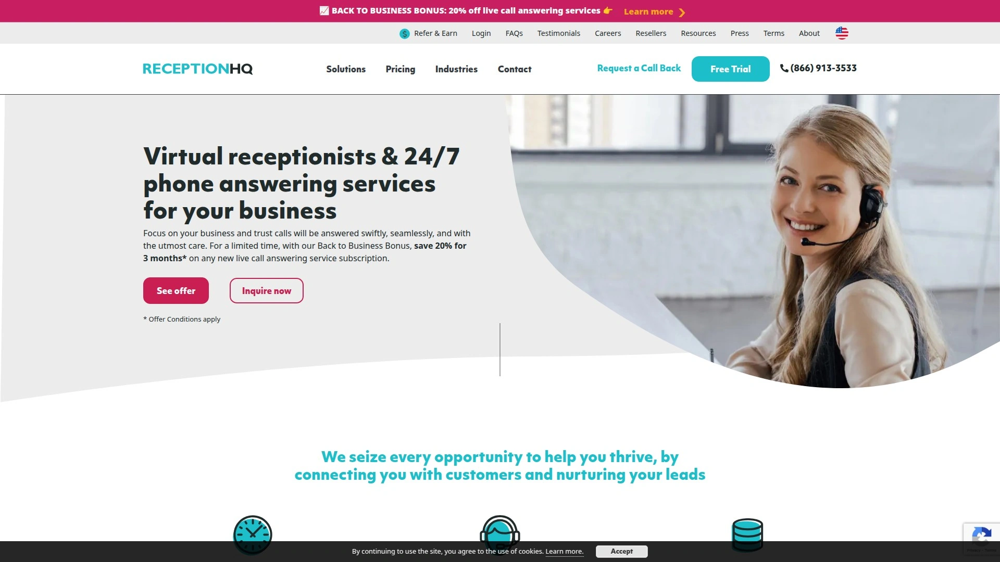

ReceptionHQ的高度训练虚拟接待员能够帮助企业全天候防止错过商务来电。平台提供7天免费试用电话接听服务,无需信用卡即可体验完整功能。作为全球运营的虚拟接待服务提供商,ReceptionHQ特别适合有国际客户或跨时区运营需求的企业。

虚拟接待员经过专业培训,能够代表企业品牌专业地接听来电、回答常见问题、筛选来电者并根据预设规则转接或记录消息。平台支持多种通知方式,包括电子邮件、短信或应用推送,确保重要消息及时送达。定制化脚本和呼叫流程允许企业根据自身需求调整接听方式,保持品牌一致性。

在线管理门户提供实时呼叫数据、历史记录和录音访问,方便企业监控服务质量并进行数据分析。平台的灵活定价模式适合各种规模的企业,从个体创业者到大型团队都能找到合适的套餐。无长期合同锁定,企业可根据业务发展随时调整或取消服务。

## **[Answering365](https://www.answering365.com)**

提供全方位呼叫中心服务和虚拟助理支持的综合性平台。

Answering365提供24/7呼叫处理、消息传递、预约安排、虚拟接待员和虚拟助理服务,配备定制化脚本和多样化的通信选项。作为综合性呼叫中心服务提供商,平台不仅处理来电接听,还提供更广泛的客户支持和行政助理功能。

定制化脚本确保每次来电都按照企业的具体要求处理,保持品牌声音和服务标准的一致性。预约安排功能与企业日历系统集成,虚拟接待员可以实时查看可用时段并直接为客户预订,减少往返沟通。消息传递服务支持多种格式和渠道,包括电子邮件、短信、语音信箱转文字等,确保信息高效传递。

虚拟助理服务超越了基础的电话接听,可协助处理数据录入、客户跟进、订单处理等行政任务。平台特别适合需要综合性后勤支持的中小企业,一站式解决多种客户沟通和行政管理需求。灵活的服务套餐允许企业根据实际需要选择特定功能组合,避免为不必要的服务付费。

## **[Aircall](https://aircall.io)**

面向成长型企业的云端通话平台,配备可定制AI语音助手和200+集成。

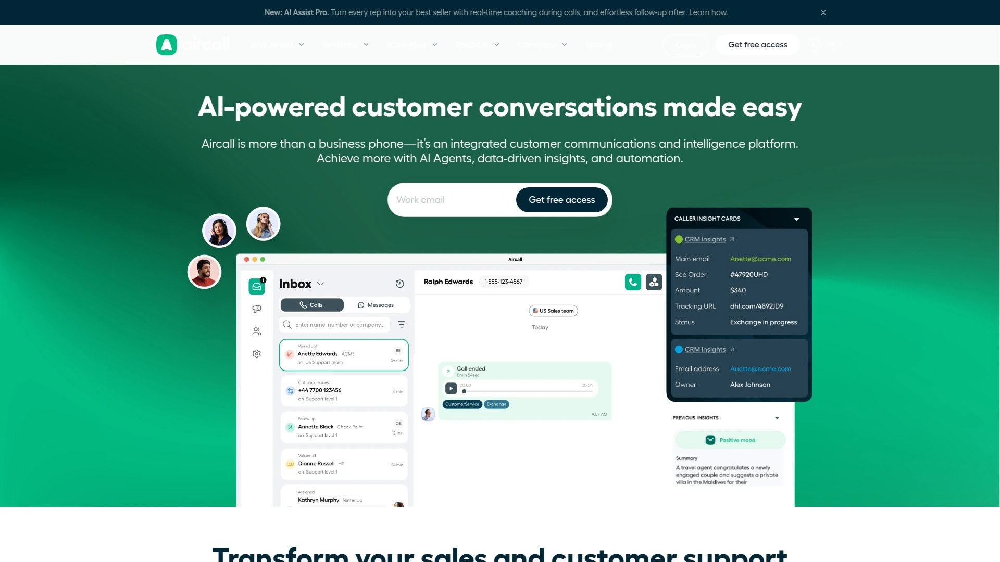

Aircall为成长型企业提供虚拟接待员服务,帮助管理来电、筛选潜在客户、预约登记和来电路由,可通过自动化或真人客服实现。平台突出优势在于可定制的AI语音助手、按需付费的灵活性以及与200多个CRM和通信工具的集成。

核心功能包括24/7电话覆盖、语音助手训练和定制、潜在客户筛选、呼叫标记、按需付费灵活性和实时监控。平台与ActiveCampaign、HubSpot、Microsoft Teams、Salesforce、Slack和Zendesk等主流企业软件无缝集成。定价从每用户每月30美元起(按年计费),AI语音助手按每分钟0.99美元额外收费。

云端架构意味着无需安装硬件或复杂的IT设置,企业可以快速部署并立即开始使用。实时监控功能允许管理者随时查看通话状态、团队绩效和客户互动质量。呼叫标记系统帮助企业分类和分析不同类型的来电,优化资源分配和响应策略。适合技术导向的企业和需要深度CRM集成的团队。

## **[JustCall](https://justcall.io)**

多语言AI客服平台,配备移动和桌面应用及实时呼叫分析功能。

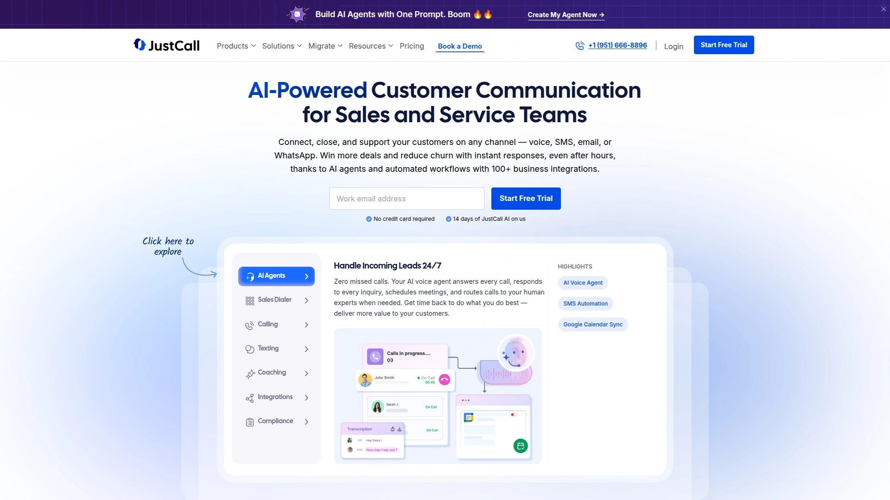

JustCall提供多语言AI客服、移动和桌面应用以及实时呼叫分析,与HubSpot、monday.com、Salesforce和Zapier等工具集成。定价从每月29美元起(按年计费),AI语音助手按每分钟0.99美元额外收费。平台的多语言能力特别适合服务国际客户或多元文化市场的企业。

移动和桌面应用确保团队成员无论在办公室还是远程工作都能保持高效沟通。实时呼叫分析提供详细的通话数据,包括通话时长、等待时间、接听率和客户满意度指标。呼叫黑名单功能自动过滤骚扰电话和不必要的来电,节省团队时间并提高工作效率。

AI客服可以处理常规查询、提供基本信息并在需要时无缝转接至真人客服。与Zapier的集成开启了无限自动化可能性,企业可以创建自定义工作流连接数千个应用。平台适合需要灵活移动办公和深度数据分析的现代化团队。

## **常见问题**

**如何选择适合小型企业的虚拟接待员服务?**
选择时应重点考虑四个因素:预算范围(入门套餐从59美元到350美元/月不等)、行业特殊需求(医疗行业需HIPAA合规如Go Answer,法律行业需专业培训如PATLive)、呼叫量大小(高呼叫量选择按分钟计费更经济如AnswerFirst或PATLive)以及集成需求(需要CRM集成选择Aircall或Smith.ai)。Ruby适合大多数中小企业的综合需求,Davinci Virtual适合预算有限的初创企业。

**虚拟接待员服务如何提升客户满意度和转化率?**
虚拟接待员确保平均10秒内接听来电,避免客户因等待而流失至竞争对手。专业培训的客服团队能够准确回答常见问题、高效安排预约并筛选高质量潜在客户,使企业主只需与符合标准的客户通话。24/7全天候覆盖捕获下班后和周末的商机,Ruby每年为客户捕获超过160万个潜在客户。真人接听而非语音信箱提升了第一印象和品牌专业度,研究显示60.2%的企业通过接听服务实现了客户满意度和留存率的改善。

**AI接待员和真人接待员有何区别?**
AI接待员如Smith.ai和Abby Connect提供的方案能够24/7自动处理常规查询、基本信息提供和简单呼叫路由,成本更低且可无限扩展。真人接待员擅长处理复杂情况、情感化沟通和需要判断力的决策,提供更个性化的客户体验。最佳实践是采用混合模式:AI处理常规任务并将复杂问题升级至真人客服,如Smith.ai的人机协作模式在保证服务质量的同时优化成本。PATLive和AnswerConnect等纯真人服务更适合需要高度个性化触感的行业如法律和高端服务。

## 结论

选择合适的虚拟接待员服务能够显著提升企业的客户沟通效率和商机捕获能力,本文介绍的15个平台各具特色,从经济实惠的Davinci Virtual到功能全面的行业领导者Ruby,从HIPAA合规的医疗专业Go Answer到AI增强的Smith.ai,覆盖了不同行业和预算需求的多种场景。**[Ruby](https://www.ruby.com)**以其10秒内的平均响应速度、每年160万+潜在客户捕获量以及超过20年的小型企业服务经验,特别适合需要全方位专业电话管理的中小企业,其24/7真人客服和AI增强技术的结合确保了服务质量和成本效益的最佳平衡。无论您是律师事务所、医疗诊所、建筑承包商还是初创公司,根据业务规模、呼叫量和行业合规要求选择合适的平台,都能有效节省时间、提升客户满意度并实现业务增长。
